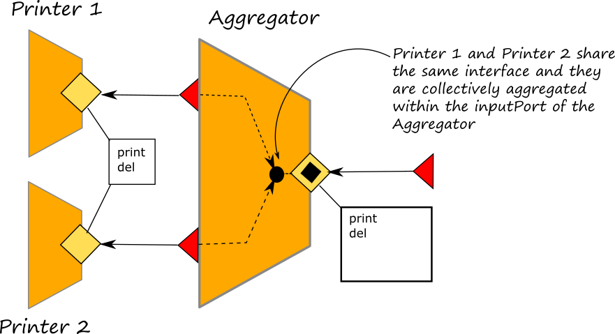
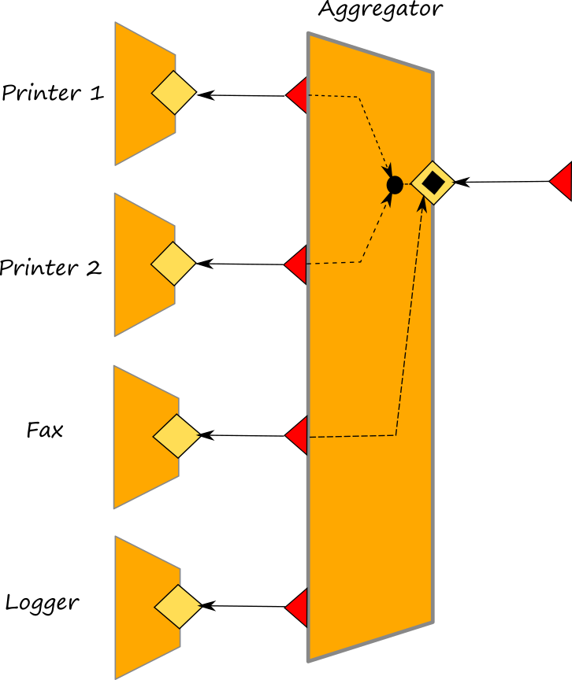

# Collections

A collection is a set of output ports that share the same interface. They can be used in combination with [Aggregation](../aggregation/README.md) and [Couriers](../couriers/README.md#courier-processes) in order to public their interface into an aggregator and then forward the message to an output port of the collection depending on a specific rule.

## Collection syntax

The syntax of collection is very simple, it is sufficient to group the output ports with the same interface within curly brackets:

```jolie
inputPort AggregatorPort {
    Location: ...
    Protocol: ...
    Aggregates:
        { outputPort_11, outputPort_12, ... },
        //  ...
        { outputPort_n1, outputPort_n2, ... },
}

/*
where outputPort_11 and outputPort_12 share the same interface and,
outputPort_n1 and outputPort_n2 share another interface */
```

Once a message is received on the shared interface, a courier process can be executed for running specific logics for the message delivery. As an example let us consider the case of an aggregator which receives messages for two printers and it delivers the message by following a cyclic approach. In the following picture we report the architecture of the example, whereas the code can be found [here](https://github.com/jolie/examples/tree/master/04_architectural_composition/08_collection/01_simple_collection)



Note that at the input port of the Aggregator and the corresponding output ports of the two aggregated services appear as it follows:

```jolie
outputPort Printer1 {
Location: ...
Protocol: sodep
Interfaces: PrinterInterface
}

outputPort Printer2 {
Location: ...
Protocol: sodep
Interfaces: PrinterInterface
}

inputPort AggregatorInput {
Location: Location_Aggregator
Protocol: sodep
Aggregates: { Printer1, Printer2 }
Interfaces: AggregatorInterface
}
```

Then, in the courier process a simple algorithm which cyclically delivers the messages to the two interfaces, is defined as it follows:

```jolie
courier AggregatorInput {
    [ interface PrinterInterface( request ) ] {
        /* depending on the key the message will be forwared to Printer1 or Printer2 */
        println@Console( ">>" + global.printer_counter )();
        if ( (global.printer_counter % 2) == 0 ) {
                forward Printer1( request )
        } else {
                forward Printer2( request )
        }
        ;
        synchronized( printer_count_write ) {
                global.printer_counter++
        }
    }
}
```

Note that the variable `global.printer_counter` is counting the message received for operations of interface `PrinterInterface`.

## Broadcasting messages

The collection can be easily used for broadcasting messages to output ports with the same interface. In this case it is sufficient to modify the courier process by forwarding the messages to all the target service as it is shown below:

```jolie
courier AggregatorInput {
    [ interface PrinterInterface( request ) ] {
        forward Printer1( request ) | forward Printer2( request )
    }
}
```

Note that here we use the parallel composition of the primitive `forward`. A complete example of message broadcasting through the usage of smart aggregation can be found [here](https://github.com/jolie/examples/tree/master/04_architectural_composition/08_collection/02_broadcasting).

## Collection and Interface extension

When using collections it is also possible to extend the interface of the collected output ports in order to add some extra data that are managed only by the aggregator. [Interface extension](../couriers/README.md#interface-extension) can be applied to all the output ports of a collection.

## A comprehensive example

Here we present a comprehensive example which includes interface extension by modifying the example described in the sections above. In this new scenario we have two printer services `Printer1` and `Printer2`, the fax service `Fax` and the service `Logger` which are all part of our trusted intranet. The full code of the example can be found [here](https://github.com/jolie/examples/tree/master/04_architectural_composition/08_collection/03_comprehensive_example).



Our aim is to deploy a service that aggregates Printer1, Printer2, and Fax to accept requests from external networks \(e.g., the Internet\), but we want to authenticate the external users that use Printer1's and Printer2's service. In particular, we with the operation `get_key` provided by the aggregator, we allow the user to get the service key to use for accessing the target service. Here, for the sake of brevity, we just simulate the authentication. Once obtained the key, the client can add it to the request directed to the target service. It is worth noting that the key is an extra data added by means of the interface extender, thus when the message is forwarded to the target service, it will be erased. Such a fact implies that the target services are not aware of the authentication logics which is totally in charge to the aggregator.

In the following the code of the aggregator:

```jolie
include "locations.iol"
include "printer.iol"
include "fax.iol"
include "console.iol"
include "logger.iol"

execution { concurrent }

type AuthenticationData:void {
    .key:string
}

interface extender AuthInterfaceExtender {
    RequestResponse:
        *(AuthenticationData)(void)
    OneWay:
        *(AuthenticationData)
}

interface AggregatorInterface {
    RequestResponse:
        get_key(string)(string)
}

outputPort Printer1 {
    Location: Location_Printer1
    Protocol: sodep
    Interfaces: PrinterInterface
}

outputPort Printer2 {
    Location: Location_Printer2
    Protocol: sodep
    Interfaces: PrinterInterface
}

outputPort Logger {
    Location: Location_Logger
    Protocol: sodep
    Interfaces: LoggerInterface
}

outputPort Fax {
    Location: Location_Fax
    Protocol: sodep
Interfaces: FaxInterface
}

inputPort AggregatorInput {
    Location: Location_Aggregator
    Protocol: sodep
    Interfaces: AggregatorInterface
    Aggregates: { Printer1, Printer2 } with AuthInterfaceExtender, Fax
}

courier AggregatorInput {
    [ interface PrinterInterface( request ) ] {
        if ( request.key == "0000" ) {
            log@Logger( "Request for printer service 1" );
            forward Printer1( request )
        } else if ( request.key == "1111" ) {
            log@Logger( "Request for printer service 2" );
            forward Printer2( request )
        } else {
            log@Logger( "Request with invalid key: " + request.key )
        }
    }

    [ interface FaxInterface( request ) ] {
        log@Logger( "Received a request for fax service" );
        forward ( request )
    }
}

init
{
    println@Console( "Aggregator started" )()
}

main
{
    get_key( username )( key ) {
        if ( username == "username1" ) {
            key = "0000"
        } else if ( username == "username2" ) {
            key = "1111"
        } else {
            key = "XXXX"
        };
        log@Logger( "Sending key for username " + username )
    }
}
```

Above, the aggregator exposes the inputPort `AggregatorInput` that aggregates the `Fax` service \(as is\) and `Printer1` and `Printer2` services. `Printer1`'s and `Printer2`'s operations types are extended by the `AuthInterfaceExtender`.
