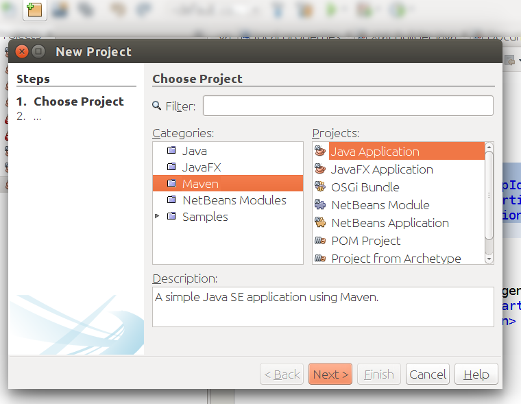
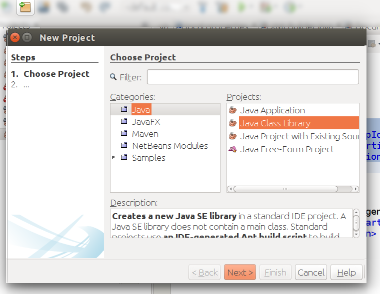
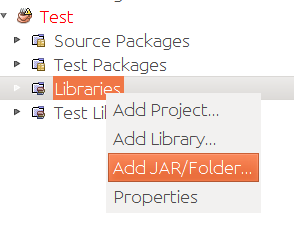
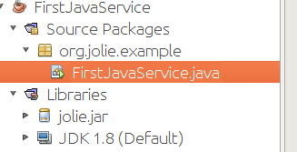

<!-- cSpell: ignore javac, Dfile, Dgroup, Dartifact Dversion, Dpackaging -->
# Java Services

## Embedding a Java service

When embedding a Java service, the path URL must unambiguously identify a Java class, which must also be in the Java classpath of the Jolie interpreter. The class must extend the `JavaServices` abstract class, offered by the Jolie Java library for supporting the automatic conversion between Java values and their Jolie representations.

Each method of the embedded class is seen as an operation from the embedder, which will instantiate an object using the class and bind it to the output port. Embedding Java services is particularly useful for interacting with existing Java code or to perform some task where computational performance is important.

## The `println@MyConsole` example

Many services of the Jolie standard library \(like `Console`\) are Java services.

Each public method of the Java Service is an input operation invocable by the embedder. Depending on the output object, each method represents a one-way operation \(if the output is void\) or a request-response \(for non-void outputs\). This behaviour can be overridden by using the `@RequestResponse` annotation when declaring a void-returning operation.

Let us write our own `MyConsole` Java service that offers a `println` request-response operation. `println` is a public method of `MyConsole` class that takes a string as request and prints it at console.

```java
package example;
import jolie.runtime.JavaService;

public class MyConsole extends JavaService {
    public void println( String s  ) {
        System.out.println( s );
    }
}
```

Once stored in the `example` folder, as defined by the package statement, our Java class must be compiled into a .jar library and added to the folder "javaServices" in Jolie's installation directory:

* run the Java compiler on our MyConsole.java file adding the _jolie.jar_ library in the classpaths \(`-cp`\): `javac -cp /path/to/jolie.jar MyConsole.java`;
* compress the MyConsole.class file into a .jar library with the `jar` command: `jar cvf example.jar example/MyConsole.class`
* move the example.jar file into the `lib` folder of your current directory.

Now that you have the implementation of your Java service, we need to make it accessible to Jolie code. For this, create a file called `my-console.ol` with the following content:

```jolie
interface MyConsoleInterface {
    OneWay: println( string )
}

service MyConsole {
    inputPort Input {
        location: "local"
        interfaces: MyConsoleInterface
    }   foreign java {
        class: "example.MyConsole"
    }
}
```

It is now possible to embed `MyConsole` within a Jolie service, just like you would embed any other service:

```jolie
from .my-console import MyConsole

service Main {
    embed MyConsole as console   main {
        println@console( "Hello World!" )
    }
}
```

## Using a request-response operation in Java services

To practice on request-response operations between embedded and embedder, let us rewrite the _twice_ service used in the section [Embedding Jolie Services](../../../../tutorials/advanced-scenarios/supporting-new-protocols-in-jolie/README.md#first-compilation-and-execution).

We use the previously written Java Service `MyConsole` to print the result and show how to embed multiple classes.

```java
package example;

import jolie.runtime.JavaService;

public class Twice extends JavaService {
    public Integer twiceInt( Integer request ) {
        Integer result = request + request;
        return result;
    }   public Double twiceDouble( Double request ) {
        Double result = request + request;
        return result;
    }
}
```

Note that both input and output types of each method, although meant to be primitive types `int` and `double`, must be declared as their wrapping classes, respectively `Integer` and `Double`.

Define a `twice.ol` module accordingly:

```jolie
interface TwiceInterface {
RequestResponse:
    twiceInt( int )( int ),
    twiceDouble( double )( double )
}

service Twice {
    inputPort Input {
        location: "local"
        interfaces: TwiceInterface
    }   foreign java {
        class: "example.Twice"
    }
}
```

Following, the Jolie service embeds both MyConsole and Twice classes:

```jolie
from .my-console import MyConsole
from .twice import Twice

service {
    embed MyConsole as console
    embed Twice as twice
    main {
        intExample = 3;
        doubleExample = 3.14;
        twiceInt@twice( intExample )( intExample );
        twiceDouble@twice( doubleExample )( doubleExample );
        println@console("intExample twice: " + intExample );
        println@console("doubleExample twice: " + doubleExample )
    }
}
```

## Handling structured messages and embedder's operations invocation

A Java Service can also invoke operations of its embedder by means of the `getEmbedder` method offered by the `JavaService` class, which returns an `Embedder` object that can be used to perform the invocations.
To exemplify its usage, consider the following service.

```jolie
from console import Console

type Split_req {
    string:string
    regExpr:string
}

type Split_res{
    s_chunk*:string
}

interface SplitterInterface {
    RequestResponse:     split( Split_req )( Split_res )
}

interface MyJavaExampleInterface {
    OneWay: start( void )
}

service Splitter {
    inputPort Input {
        location: "local"
        interfaces: SplitterInterface
    }   foreign java {
        class: "example.Splitter"
    }
}

service JavaExample {
    inputPort Input {
        location: "local"
        interfaces: MyJavaExampleInterface
    }   foreign java {
        class: "example.MyJavaExample"
    }
}

service Main {
    embed Splitter as splitter
    embed MyJavaExample as myJavaExample   inputPort Embedder {
        location: "local"
        interfaces: SplitterInterface
    }

main
{
    start@myJavaExample();
    split( split_req )( split_res ) {
        split@splitter( split_req )( split_res )
    }
}
```

The embedder acts as a bridge between two embedded Java Services, `MyJavaExample` which requests a `split` operation and, `Splitter` which implements it.

```java
package example;

import jolie.runtime.JavaService;
import jolie.net.CommMessage;
import jolie.runtime.Value;
import jolie.runtime.ValueVector;

public class JavaExample extends JavaService {   public void start(){
        String s_string = "a_steaming_coffee_cup";
        String s_regExpr = "_";       Value s_req = Value.create();
        s_req.getNewChild("string").setValue(s_string);
        s_req.getNewChild("regExpr").setValue(s_regExpr);       try {
            System.out.println("Sent request");
            Value s_array = getEmbedder().callRequestResponse( "split", s_req );
            System.out.println("Received response");           Value s_array = response.value();
            ValueVector s_children = s_array.getChildren("s_chunk");
            for( int i = 0; i
```

After `start()` is called by the embedder, our Java Service creates a `Value` object according to the `Split_req` type definition. In the try block, it then obtained a reference to the `Embedder` object \(representing the embedder Jolie service\) and uses its `callRequestResponse` method to invoke operation `split` at the embedder. The method returns a value \(`s_array`\) containing the response from the service. Notice that the embedder needs to expose this operation in an input port with location `local`.

After receiving the response, the service prints at console the subnodes of the response exploiting the `ValueVector` object.

The comprehensive code of this example can be downloaded here:

[Embedding Java Code Example](https://github.com/jolie/docs/raw/v1.10.x/web/files/architectural_composition/code/embedding_java_code.zip)

## Creating a JavaService

This tutorial explains how to develop JavaService classes which can be easily embedded into a Jolie service. For the sake of clarity, here we consider to use [Netbeans IDE](http://www.netbeans.org) as a project management tool, but the following instructions can be easily adapted to any kind of Java IDE.

The tutorial also presents some features of Java integration in Jolie, i.e., manipulating Jolie values in Java, calling operations from a Java service, and the dynamic embedding of JavaServices.

### Creation of a JavaService project

* If you are using Maven, just click on “New Project” icon and then select **Maven** -&gt; **Java Application** as reported in the following picture.



* If you are creating a new project from scratch click on “New Project” icon and then select **Java** -&gt; **Java Class Library**



Then, follows the instructions and give a name to the project \(ex: `FirstJavaService`\) and define the working directory.

### Dependencies

Before continuing with the development of a JavaService keep in mind that there is a dependency you need to add to your project to properly compile the JavaService code: the jar `jolie.jar` which comes with your Jolie installation. Follow these instructions to prepare the file to be imported into your project:

* Locate the `jolie.jar` file into your system: Jolie is usually installed into `/usr/lib/jolie` folder for linux like operating systems and in `C:\Jolie` for Windows operating systems. In the installation folder of Jolie you can find the file `jolie.jar`. If you are not able to locate the `jolie.jar` file or you require some other Jolie versions, [here](https://github.com/jolie/website/tree/master/www/files/releases) you can find the complete list of all the available releases of Jolie. Download the release you need.
* If you use Maven you could register the dependency in your local repo by using the following command `mvn install:install-file -Dfile=<path-to-jolie.jar>/jolie.jar -DgroupId=jolie -DartifactId=jolie -Dversion=<version> -Dpackaging=jar`

**NOTE** We are working to register the dependency `jolie.jar` into [Maven Central](https://search.maven.org). If `jolie.jar` is available into Maven Central the step above can be skipped.

### Importing the Jolie dependency into your JavaService project

If you use Maven it is very easy to import the Jolie dependency into your project, just add the following dependency into your `pom.xml` file:

```xml
<dependency>
    <groupId>org.jolie-lang</groupId>
    <artifactId>jolie</artifactId>
    <version>1.10.5</version>
</dependency>
```

If you manually manage your project just add the `jolie.jar` as an external dependency. In Netbeans you have to:

* Expand your project
* Right mouse button on _Libraries_
* Select _Add JAR/Folder_
* Select the `jolie.jar` file from the path selector



### The first JavaService

As a first example of a JavaService we present a sample scenario where we suppose to extend the features of a Jolie service by exploiting native Java computation. The architecture of the final system will look as it is represented in the following picture:


As it is possible to note, here the Jolie service communicates with the JavaService with a synchronous call equivalent to a RequestResponse.

Before writing the actual code of the JavaService it is important to create the package which will contain it. Let us name it `org.jolie.example`. Then, let us create the new Java file called `FirstJavaService.java`.



#### Writing the JavaService code

Here we present the code of our first JavaService which simply prints out on the console a message received from an invoker and then reply with the message `I am your father`.

```java
package org.jolie.example;

import Jolie.runtime.JavaService;
import Jolie.runtime.Value;

public class FirstJavaService extends JavaService
{
    public Value HelloWorld( Value request ) {
        String message = request.getFirstChild( "message" ).strValue();
        System.out.println( message );
        Value response = Value.create();
        response.getFirstChild( "reply" ).setValue( "I am your father" );
        return response;
    }
}
```

In the code there are some important aspects to be considered:

* We need to import two classes from the Jolie dependency: `jolie.runtime.JavaService` and `jolie.runtime.Value`
* the class `FirstJavaService` must be extended as a JavaService: `... extends JavaService`
* the request parameter and the response one are objects `Value`
* it is possible to navigate the tree of a `Value` by using specific methods like `getFirstChild` \(see below\)
* the request message has a subnode `message` which contains a string
* the response message will contain the reply message in the subnode `reply`
* the core logic of the JavaService is just the line `System.out.println("message")` which prints out the content of the variable message on the console

#### Building the JavaService

Now we can build the JavaService, in particular we need to create a resulting `jar` file to be imported into the corresponding Jolie project. To do this, just click with the mouse right button on the project and select **Clean and Build**.

If you are managing the project with Maven you will find the resulting jar in folder _target_, whereas if you are manually managing the project you can find it in the folder _dist_.

#### Executing the JavaService

Now we are ready for embedding the JavaService into a Jolie service. It is very simple, just follow these steps:

* Create a folder where placing your Jolie files, ex: `JolieJavaServiceExample`

* Create a subfolder named `lib` \(`JolieJavaServiceExample/lib`\)
* Copy the jar file of your JavaService into the folder `lib` \(jolie automatically imports all the libraries contained in the subfolder `lib`\)

* Create a Jolie file where defining the wrapping `service` block for your JavaService and name it `first-java-service.ol`.
It is worth noting that all the public methods defined in the class FirstJavaService can be promoted as operations at the level of the wrapping Jolie service.
In our example the interface is called `FirstJavaServiceInterface` and it declares one operation called `HelloWorld` \(the name of the operation must be the same name of the corresponding operation in the JavaService\).
The request and response message types define two messages where the former has a subnode named `message` and the latter is named `reply`.

```jolie
type HelloWorldRequest {
    message:string
}

type HelloWorldResponse {
    reply:string
}

interface FirstJavaServiceInterface {
    RequestResponse:
        HelloWorld( HelloWorldRequest )( HelloWorldResponse )
}

service FirstJavaService {
    inputPort Input {
        location: "local"
        interfaces: FirstJavaServiceInterface
    } foreign java {
        class: "org.jolie.example.FirstJavaService"
    }
}
```

* In the code of your Jolie service, embed the wrapper Jolie service. You can name the resulting output port as you prefer \(there are no restrictions\), in this example we use the name `firstJavaService`.

```jolie
from .first-java-service import FirstJavaService

service Main {
    embed FirstJavaService as firstJavaService
```

* Complete your Jolie code.

Here we report a complete example of a Jolie code which calls the JavaService and prints out its response on the console. Save it in a file named `main.ol`.

```jolie
from .first-java-service import FirstJavaService
from console import Console

service Main {
    embed FirstJavaService as firstJavaService
    embed Console as console main {
        request.message = "Hello world!"
        HelloWorld@firstJavaService( request )( response )
        println@console( response.reply )()
    }
}
```

At this point your Jolie working directory should look like the following one:

* _your Jolie working directory_
    * **lib**
        * FirstJavaService.jar
    * first-java-service.ol
    * main.ol

You can run the Jolie program by using the simple command `jolie main.ol`.

**NOTE** to avoid the creation of folder _lib_, it is possible to link the dependency _FirstJavaService.jar_ in the command line as it follows: `jolie -l <path-to-dependency>/FirstJavaService.jar main.ol`. In this way you are free to place the dependency where it is more suitable for you.

## Using the JavaService into a Jolie service

In the previous example we just wrote a Jolie program which exploits the JavaService _FirstJavaService_. Clearly, it is possible to exploit the same JavaService within a Jolie service by adding an inputPort to the previous program.


In the following case we present a possible solution where the operation of the JavaService is exported to the inputPort by exploiting the same interface `FirstJavaServiceInterface` with a new implementation of the operation `HelloWorld` in the main scope of the service.

```jolie
from .first-java-service import FirstJavaService
from console import Console

service Main {
    execution: concurrent embed FirstJavaService as firstJavaService
    embed Console as console inputPort MyInputPort {
        location: "socket://localhost:9090"
        protocol: sodep
        interfaces: FirstJavaServiceInterface
    } main {
        HelloWorld( request )( response ) {
            println@console("I am the embedder")()
            HelloWorld@firstJavaServiceOutputPort( request )( response )
        }
    }
}
```

Such a scenario is useful when we need to add some extra computation within the behaviour before invoking the JavaService \(in the example we print out the request message before forwarding it to the JavaService\). In those cases where there is no need to manipulate the messages in the behaviour, we could directly aggregate the JavaService outputPort in the inputPort of the service by obtaining a direct connection between the Jolie inputPort and the JavaService.

```jolie
from .first-java-service import FirstJavaService
from console import Console

service Main {
    execution: concurrent embed FirstJavaService as firstJavaService inputPort MyInputPort {
        location: "socket://localhost:9090"
        protocol: sodep
        aggregates: firstJavaService
    } main {
    ...
```

## Manipulating Jolie values in Java

In this section we deepen the usage of the class `Value` which allows for the management of Jolie value trees within Java.

### Creating a value

First of all, we need to create a Value in Java as we would do in Jolie. The following Java code creates a Value named `v`.

```java
Value v = Value.create();
```

### Getting the vector elements

In each Jolie tree, a node is a vector. To access/get the vector elements of a node, you can use the method `getChildren( String subnodeName )` which returns the corresponding `ValueVector` of the subnode `subnodeName`. In the following example we get all the vector elements of the subnode `subnode1`.

```java
ValueVector vVector = v.getChildren("subnode1");
```

All the items of a ValueVector are Value objects. To access the Value element at index _i_ it is possible to use the method `get( int index )`. In the following example we access the third element of the subnode `subnode1` where 0 is the index of the first element.

```java
ValueVector vVector = v.getChildren("subnode1");
Value thirdElement = vVector.get( 2 );
```

### Setting the value of an element

It is possible to use the method `setValue( ... )` for setting the value content of an element as in the following example:

```java
ValueVector vVector = v.getChildren("subnode1");
Value thirdElement = vVector.get( 2 );
thirdElement.setValue("Millennium Falcon");
```

### Getting the value of an element

Once accessed a vector element \(a value in general\), it is possible to get its value by simply using one of the following methods depending on the type of the content:

* `strValue()`
* `intValue()`
* `longValue()`
* `boolValue()`
* `doubleValue()`
* `byteArrayValue()`.

In the following example we suppose to print out the content of the third element of the subnode `subnode1` supposing it is a string.

```java
ValueVector vVector = v.getChildren("subnode1");
Value thirdElement = vVector.get( 2 );
thirdElement.setValue("Millennium Falcon");
System.out.println( thirdElement.strValue() );
```

## Annotations

Each public method programmed within a JavaService must be considered as an input operation that can be invoked from the embedder. Depending on the return object the method represents a OneWay operation or a RequestResponse one. If the return type is `void`, the operation is considered a OneWay operation, a RequestResponse operation otherwise. You can override this behaviour by using the `@RequestResponse` annotation, which forces Jolie to consider the annotated method as a RequestResponse operation.

## Faults

Faults are very important for defining a correct communication protocol between a JavaService and a Jolie service. Here we explain how managing both faults from the JavaService to the embedder Jolie service and vice-versa.

### Sending a Fault from a Java service

Let us consider the _FirstJavaService_ example where we call the method `HelloWorld` of the JavaService. In particular, let us modify the Java code to reply with a fault in case the incoming message is wrong.

```java
public Value HelloWorld( Value request ) throws FaultException {
    String message = request.getFirstChild( "message" ).strValue();
    System.out.println( message );
    if ( !message.equals( "I am Luke" ) ) {
        Value faultMessage = Value.create();
        faultMessage.getFirstChild( "msg" ).setValue( "I am not your father" );
        throw new FaultException( "WrongMessage", faultMessage );
    }
    Value response = Value.create().getFirstChild( message );
    response.getFirstChild( "reply" ).setValue( "I am your father" );
    return response;
}
```

Note that the method `HelloWorld` throws an exception called `FaultException` that comes from the _jolie.runtime_ package. A simple Java exception **is not** recognized by the Jolie interpreter as a Fault, only those of FaultException type are. The creation of a _FaultException_ is very simple, the constructor can take one or two parameters. The former one is always the name of the fault, whereas the latter one, if present, contains the fault value tree \(in the example a message with a subnode `msg`\). The fault value tree is a common object of type _Value_. On the Jolie service side, there is nothing special but the fault is managed as usual.

Getting to the code, we need to update the Jolie wrapper module for `FirstJavaService` such that it declares the fault:

```jolie
type HelloWorldRequest {
    message:string
}

type HelloWorldResponse {
    reply:string
}

type WrongMessageFaultType {
    msg:string
}

interface FirstJavaServiceInterface {
    RequestResponse:
        HelloWorld( HelloWorldRequest )( HelloWorldResponse ) throws WrongMessage( WrongMessageFaultType )
}

service FirstJavaService {
    inputPort Input {
        location: "local"
        interfaces: FirstJavaServiceInterface
    } foreign java {
        class: "org.jolie.example.FirstJavaService"
    }
}
```

We can then use it and manage the fault as usual in an embedding Jolie service:

```jolie
from console import Console
from first-java-service import FirstJavaService

service Main {
    embed FirstJavaService as firstJavaService
    embed Console as console main {
        install( WrongMessage => println@Console( main.WrongMessage.msg )() ) 
        request.message = "I am Obi"
        HelloWorld@FirstJavaServiceOutputPort( request )( response )
        println@Console( response.reply )()
    }
}
```

### Managing fault responses

In Jolie a RequestResponse message can return a fault message which must be managed into the JavaService. Such a task is very easy and can be achieved by checking if the response is a fault or not by exploiting method `isFault` of the class `CommMessage` as reported in the following code snippet:

```java
try {
    Value response = getEmbedder().callRequestResponse( request );
    System.out.println( response.value().strValue() );
} catch( FaultException e ) {
    System.out.println( e.faultName() );
}
```

## JavaService dynamic embedding

So far, we have discussed the possibility to statically embed a JavaService. In this case the JavaService is shared among all the sessions created by the embedder. In some cases, it could be particularly suitable to embed an instance of JavaService for each running session of the embedder. Such a task can be fulfilled by exploiting the dynamic embedding functionality supplied by the `Runtime` of Jolie. In the following example we present the Java code of a JavaService which simply returns the value of a counter that is increased each time it is invoked on its method `start`.

```java
public class FourthJavaService extends JavaService {
    private int counter;
    public Value start( Value request ) {
        counter++;
        Value v = Value.create();
        v.setValue( counter ); return v;
    }
}
```

In the following code we report a classical embedding of this JavaService wrapper:

```jolie
// fourth-java-service.ol
interface DynamicJavaServiceInterface {
    RequestResponse:
        start( void )( int )
}

service DynamicJavaService {
    inputPort Input {
        location: "local"
        interfaces: DynamicJavaServiceInterface
    } 
    
    foreign java {
        class: "org.jolie.example.FourthJavaService"
    }
}
```

if we run a client that calls the service ten times as in the following code snippet:

```text
from fourth-java-service import DynamicJavaService
from console import Console
service main { embed DynamicJavaService as DynamicJavaService
    embed Console as Console main {
        for ( i = 0 , i < 10 , i ++ ){
            println@Console("Received counter " + start@DynamicJavaService() )()
        }
    }
}
```

we obtain:

```text
Received counter 1
Received counter 2
Received counter 3
Received counter 4
Received counter 5
Received counter 6
Received counter 7
Received counter 8
Received counter 9
Received counter 10
```

In this case the JavaService is shared among all the sessions and each new invocation will increase its inner counter.

Now let us see what happens if we dynamically embed it as reported in the following service:

```jolie
from fourth-java-service import DynamicJavaServiceInterface
from console import Console
from runtime import Runtime

service main { embed Console as Console
    embed Runtime as Runtime
    outputPort DynamicJavaService {
        Interfaces: DynamicJavaServiceInterface
    }
    
    main {
        for ( i = 0 , i < 10 , i ++ ){
            with( emb ) {
                .filepath = "org.jolie.example.DynamicJavaService"
                .type = "Java"
            }
            loadEmbeddedService@Runtime( emb )( DynamicJavaService.location )

            println@Console("Received counter " + start@DynamicJavaService() )()
        }
    }
}
```

Note that we imported `runtime` package to exploit `loadEmbeddedService` operation. Such an operation permits to dynamically embed the JavaService in the context of the running session. The operation returns the memory location which is directly bound in the location `DynamicJavaService.location` that is the location of outputPort `DynamicJavaService`.

Now, if we run the same client as in the example before, we obtain the following result:

```text
Received counter 1
Received counter 1
Received counter 1
Received counter 1
Received counter 1
Received counter 1
Received counter 1
Received counter 1
Received counter 1
Received counter 1
```

Such a result means that for each session enabled on the embedder, a new JavaService object is instantiated and executed, thus the counter will start from zero every invocation.
